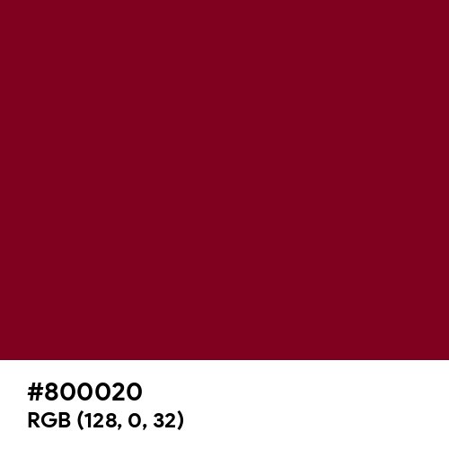

# README for "ARTHEMIS COCKTAIL BAR"

## ARTHEMIS COCKTAIL BAR

Welcome to the repository for "ARTHEMIS COCKTAIL BAR," a role-playing game set in the 1920s. This web page serves as a landing page for the game, providing basic information and allowing users to download the necessary game files.

## Project Structure

- `index.html`: The main HTML file containing the structure of the page.
- `styles.css`: CSS file that contains the styles for the page, including the design with wine-colored details.
- `script.js`: JavaScript file (optional) for handling page functionality, such as the download button and section navigation.

## Features

### Main Page
- **Title**: "ARTHEMIS COCKTAIL BAR" in Copperplate Gothic Light font.
- **Download Button**: Allows users to download the game files.
- **Header**: Section to choose if you want to learn more about the story.
- **Decoration**: Red chevron at the end of the page for a stylish touch.

## Requirements

To view and edit the web page locally, you will need:

- An updated web browser.
- A text editor or an Integrated Development Environment (IDE) such as Visual Studio Code.

## Usage Instructions

1. **Clone the repository**:

```bash
  $ git clone https://github.com/Duxy1996/Arthemis-role.git
```

2. Navigate to the project directory:

```bash
  $ cd arthemis-cocktail-bar
```

3. Open the index.html file in your browser:

You can do this directly by double-clicking the index.html file.
Or you can use a local server for convenience. If you have Python installed, you can run:

```bash
  $ python -m http.server
```
and then open http://localhost:8000 in your browser.

## Customization

Title and Font
To change the title or the font, edit the corresponding section in index.html and styles.css:

* Title: Find the <h1> tag in index.html and modify the content.

* Font: Ensure the Copperplate Gothic Light font is applied correctly in styles.css:

```css
h1 {
  font-family: 'Copperplate Gothic Light', sans-serif;
}
```

## Decoration
To modify the chevron at the end of the page, adjust the CSS in styles.css:

```css
.chevron-section {
  background-color: #C0504D;
  height: 50px;
  width: 100%;
  position: absolute;
  bottom: 0;
}

.chevron-section::before {
  content: "";
  display: block;
  position: absolute;
  bottom: 50px;
  right: 0;
  width: 100%;
  height: 200px;
  background-color: #C0504D;
  clip-path: polygon(50% 100%, 100% 100%, 100% 0);
}

.chevron-section::after {
  content: "";
  display: block;
  position: absolute;
  bottom: 50px;
  left: 0;
  width: 100%;
  height: 200px;
  background-color: #C0504D;
  clip-path: polygon(50% 100%, 0% 100%, 0% 0)
}
```

Here is a good reference to modify the chevron: [clip-path](https://developer.mozilla.org/en-US/docs/Web/CSS/clip-path)

##  Design and Style

### Art and color
The design of the page is inspired by Art Deco, characterized by its bold geometry and rich colors. The primary color used is a deep wine (#800020), providing a luxurious and vintage feel. The chevron decoration at the bottom of the page adds a distinctive touch reminiscent of the 1920s aesthetic.

Color palette suggested: [palette](https://www.color-hex.com/color-palette/503)

Color description: [color](https://www.color-name.com/hex/800020#color-palettes)



### Copperplate Gothic Font

I chose Copperplate Gothic for its strong connection to the early 20th century, aligning perfectly with the 1920s theme of "ARTHEMIS COCKTAIL BAR." Designed in 1901, this font was prevalent during the Prohibition era, adding an authentic touch to the website's aesthetic. Its use in various popular culture elements, from film titles to business cards, reflects its timeless appeal and historical significance. Copperplate Gothic not only captures the elegance and sophistication of the 1920s but also evokes a sense of nostalgia, making it an ideal choice for creating an atmosphere reminiscent of that vibrant decade.

### ARTHEMIS COCKTAIL BAR

**ARTHEMIS COCKTAIL BAR** is inspired by the speakeasies of the 1920s, where Americans sought refuge to enjoy a drink during the Prohibition era. Although the establishment itself is fictional, it captures the essence and atmosphere of those clandestine bars that became a symbol of defiance and social revolution. The name evokes the allure and mystery of a time when jazz music filled the air, and the glamour of the Roaring Twenties was in full swing, reflecting the vibrant and rebellious spirit of that period.

## Contact
If you have any questions or suggestions, please contact me or create an issue in the repository.

Thank you for your interest in "ARTHEMIS COCKTAIL BAR"! Enjoy the game.

## License
More basic and less restrictive, since the following will add more restrictions, the CC-BY license allows anyone to use the work or content for any purpose, with the option to modify it if desired and use it for commercial or non-commercial purposes. The only condition is that the author must always be credited.

